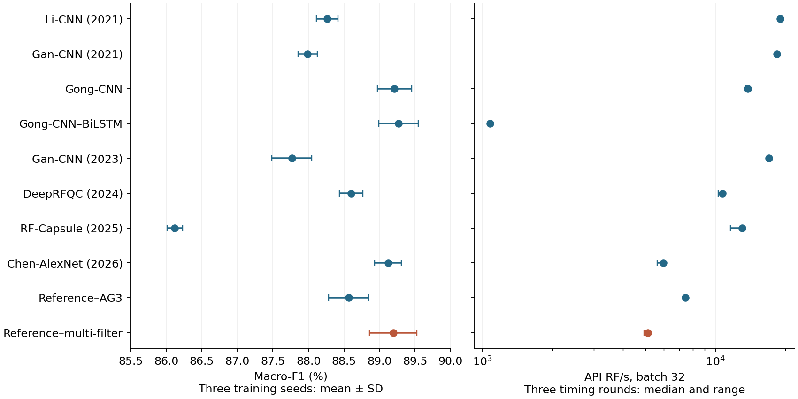

# Completed comparisons: paper snapshot of 2026-10-02

[**View the full comparison tables**](generated/COMPARISON.md) ·
[中文运行说明](../../docs/BENCHMARK_zh.md)



This snapshot accompanies **Receiver-function quality control on a common task:
a benchmark with published baselines and waveform diagnostics**, manuscript
commit `b88a6c13f6ae378d9b276bd19dcb4789af3c446d`.

It contains aggregate results from 51 original fits, 20 appended training-seed
fits, six cross-protocol fits and two single-filter sensitivity fits, plus 57
inference measurements. These counts are different experiment matrices, not
79 interchangeable replicas of one model. Nine literature configurations are
documented adaptations of eight studies; reference, supplied-descriptor,
logistic and station-context inputs remain explicitly separated.

No RF waveform arrays, manual label vectors, sample/station lists or per-record
predictions are included. The original data are not downloaded by any command.
Summary statistics, confusion counts, published curves and raw timing durations
are comparison results, not the observational dataset. Existing model weights
remain the 53 versioned v0.1.0 bundles; new seed-extension score rows do not imply
that additional weights have been silently added to the model catalog.

## Reproduce tables without data, models or a GPU

From the repository root after installing the package:

```bash
python scripts/reproduce_comparisons.py
# Optional figure, after installing the [plots] extra:
python scripts/reproduce_comparisons.py --plots
```

The script verifies all 92 source-file hashes, recalculates original three-seed
means/sample SDs and six paired eight-seed Student-t intervals, checks label
agreement and twelve cross-protocol confusion tables, and recomputes latency
and throughput from the 57 timing records. It regenerates `generated/`.
It does **not** claim to recalculate original classification accuracy or
station-bootstrap draws from unavailable individual records. The source
scripts for those steps are archived under `reproduction/`.

## Included comparisons

| Scope | Files | Interpretation |
|---|---|---|
| Original three-seed classification | `results/original_runs.csv`, `original_summary.csv`, `logistic_runs.csv` | Same 24,533-record test cohort; no transfer learning |
| Eight-seed extension | `results/eight_seed_*.csv` | Four configurations only; paired intervals, no multiplicity adjustment |
| Label definitions and cross-protocol prediction | `results/label_agreement.csv`, `cross_protocol_*.csv` | Fixed predictions evaluated under both label systems; no theoretical ceiling |
| Input noise and synthetic label changes | `results/input_perturbation.csv`, `label_perturbation.csv` | Responses on the registered grid, not a universal resolution threshold |
| RF stack and cross-filter diagnostics | `results/physical_summary.csv`, `subsample_summary.csv` | Fixed-seed same-pool waveform diagnostics, no H–κ claim |
| AG1/AG3/AG5/multi-filter | `results/frequency_control.csv` | One fixed seed on 24,107 common records; not the primary cohort |
| Deployment cost | `results/inference_summary.csv`, `timings/*.json` | 19 configurations × three timing rounds; CPU FCM is full-pool context |

The paper's original three-seed means are not overwritten by the eight-seed
extension. The multi-filter-minus-AG3 interval crosses zero; the two
Gong-minus-multi-filter intervals lie slightly above zero. No negative result
is omitted and no global equivalence or universal accuracy advantage is claimed.

## Provenance and timing boundaries

`manifest.json` identifies the manuscript commit, source paths relative to that
checkout, original SHA256 and public-file SHA256. Aggregate CSVs are copied
unchanged. Timing records retain every duration and statistical result but omit
machine paths, GPU UUIDs and raw identifiers; the manifest explicitly records
this projection. `protocol.json` is likewise a public projection, with the
original protocol/script digests retained. It must not be represented as the
byte-identical private protocol.

The recorded inference experiment used released **v0.1.0**, one RTX 5090,
PyTorch 2.8.0+cu128, FP32 eager execution and AMP/TF32 disabled. Single-record
latency and batch-32 API throughput include preprocessing and transfers but
exclude disk/model loading, RF generation, supplied-descriptor extraction and
HTTP. Network-forward timing is separate. Neural models and CPU statistical
models are marked separately. FCM uses all 24,533 RFs at 26 stations and has no
independent-record latency. Ranges describe timing rounds, not training seeds.
See [how to run new comparisons](../../docs/BENCHMARK_zh.md).

## Original research scripts

`reproduction/paper_scripts/` and `reproduction/physical_scripts/` preserve the
analysis and verification programs executed for the manuscript. They retain
their original source-tree assumptions, recorded by their source paths in the
manifest. To rerun them against the full data, place them back into the matching
manuscript checkout and supply its verified raw run archives/cache; they are not
self-contained demos and should not be executed against this aggregate-only
snapshot. The archived original timing runner similarly requires its original
full protocol and checkpoint paths. Public portable entry points are
`rfqc-bench benchmark`, `scripts/benchmark_models.py`, `scripts/compare_models.py`
and `scripts/reproduce_comparisons.py`; these do not depend on author-machine paths.
